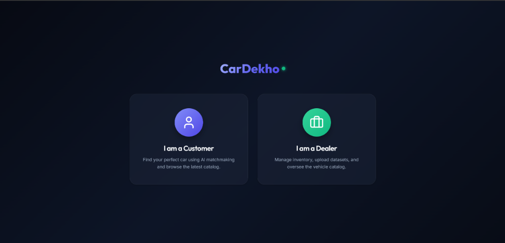
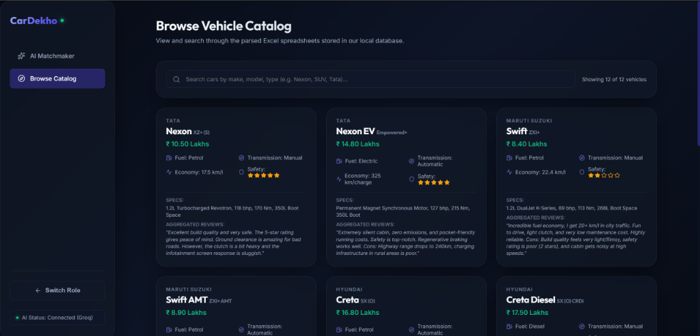
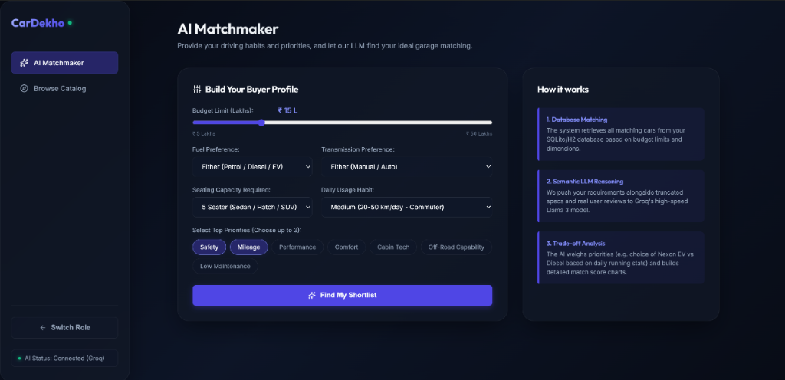
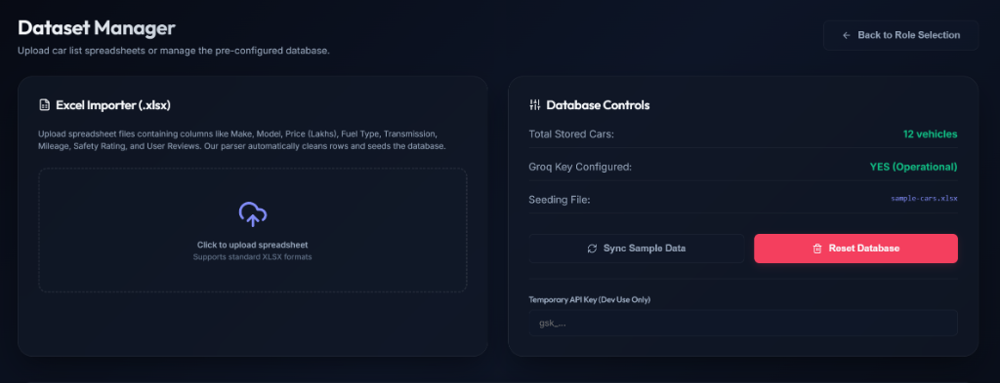
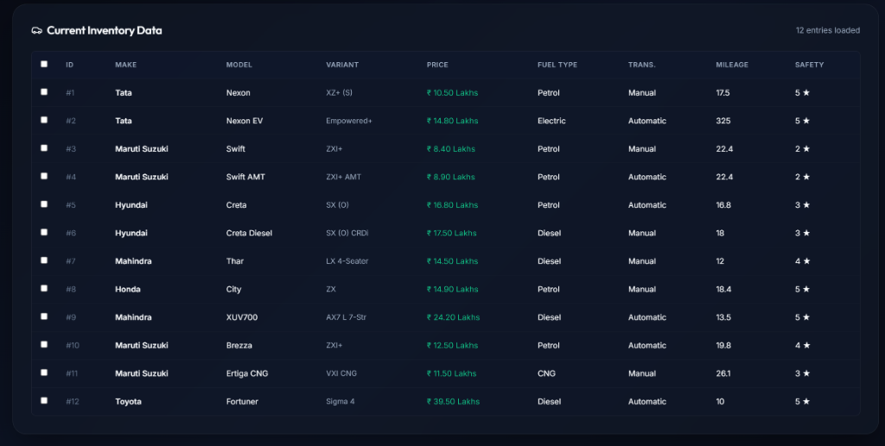
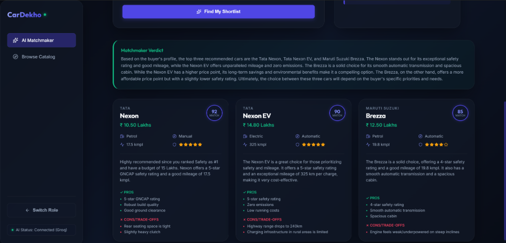

# CarDekho AI Matchmaker

An AI-native car recommendation dashboard built for the modern auto buyer.

> 🚀 **Live Demo:** [https://cardekho-ai-matchmaker.onrender.com/](https://cardekho-ai-matchmaker.onrender.com/)
> *(Note: The app is hosted on Render's free tier. If no one has visited in the last 15 minutes, the server goes to sleep. It may take **up to 50 seconds** to wake up on your first visit!)*

CarDekho AI Matchmaker allows users to simply input their constraints (budget, seating, habits) and priorities (Safety, Mileage, Performance). It queries a local SQL database of cars, truncates the dataset into a strict context window, and prompts Groq's high-speed **Llama-3.3-70b-versatile** model to construct a personalized, well-reasoned shortlist of vehicles.

<p align="center">
  
  <br/>
  <i>Role Selection Dashboard</i>
</p>

## ✨ Highlights

### AI Matchmaker
Get detailed, personalized LLM reasoning weighing trade-offs for your specific constraints.
<p align="center">
  
</p>
<p align="center">
  
</p>

### Dealer Dataset Management
Upload new spreadsheet catalogs dynamically or batch-delete outdated inventory.
<p align="center">
  
</p>
<p align="center">
  
</p>

### Browse Catalog
Explore the entire generated and parsed database dynamically.
<p align="center">
  
</p>

## 🚀 Quick Start (Docker Compose)

The absolute easiest way to run the entire stack locally is by using Docker Compose.

### Prerequisites: Docker Desktop
You must have Docker Desktop installed to run the application containers.
* **Windows**: Open PowerShell and run the following command using `winget`:
  ```powershell
  winget install Docker.DockerDesktop
  ```
  *(Alternatively, download it from the [Docker Desktop website](https://www.docker.com/products/docker-desktop/).)*
* **Mac**: Use Homebrew to install it via terminal:
  ```bash
  brew install --cask docker
  ```
  *(Or download the `.dmg` installer directly from the [Docker Desktop website](https://www.docker.com/products/docker-desktop/).)*

**Important:** Make sure to launch the Docker Desktop application after installing so that the Docker Engine starts running in the background!

> [!NOTE]
> **Troubleshooting `failed to connect to the docker API`:**
> If you get an error saying Docker cannot find the file specified or failed to connect to the daemon, it means the Docker Engine isn't running. 
> 1. Open your Windows Start Menu or Mac Applications and manually click **Docker Desktop** to launch it.
> 2. Wait until the indicator in the bottom-left corner of the app says **"Engine running"** (turns green).
> 3. Restart your terminal and run `docker-compose up --build` again.

---

### Running the App
1. Clone this repository and navigate to the project root.
2. Run the following command:

```bash
docker-compose up --build
```

The system will build both the Spring Boot backend and the React frontend. Once it says the containers are running:
- Open your browser to **http://localhost:5173** to access the UI!
- The backend Swagger UI can be found at **http://localhost:8080/swagger-ui/index.html**

## 🔑 AI Matchmaking Setup (Groq API Key)

To use the AI Matchmaker, you need a free Groq API key.
1. Go to [console.groq.com](https://console.groq.com/) and simply **Login with Google**.
2. Generate an API Key (it will start with `gsk_`).
3. *Note: Groq offers an extremely generous **free tier** that is more than enough for testing and personal use, so you won't need to enter any payment details!*

### Option A: Set it in the UI (Easiest)
Once you launch the app, click **"I am a Dealer"**. In the Dataset Manager, you'll find a field to enter your **Temporary API Key**. This will save the key to your browser's local storage and use it for matchmaking requests.
*Note: This UI field is primarily a temporary convenience for rapid development and testing without having to restart the backend container.*

### Option B: Set it via Environment Variable
If you want a more permanent setup so that you don't have to use the UI, you can supply it as an environment variable before running Docker Compose:

**Windows (PowerShell):**
```powershell
$env:GROQ_API_KEY="gsk_your_key_here"
docker-compose up --build
```
**Mac/Linux:**
```bash
GROQ_API_KEY="gsk_your_key_here" docker-compose up --build
```

## 🛠 Features

- **Semantic Matchmaking**: Ask for cars prioritizing "Safety and Cabin Tech", and the AI understands the nuance beyond just filtering.
- **Dataset Manager**: Upload `.xlsx` spreadsheets natively to expand the car database on the fly.
- **Multi-select Deletion**: Easily prune old inventory in the Dealer dashboard.
- **Spring AI Integration**: Utilizes Spring's official AI library for robust chat client interactions and automated retries.

## 📦 Tech Stack
- **Backend**: Java 21, Spring Boot 3.x, Spring AI, H2 Database
- **Frontend**: React 18, Vite, Lucide Icons, Vanilla CSS Glassmorphism
